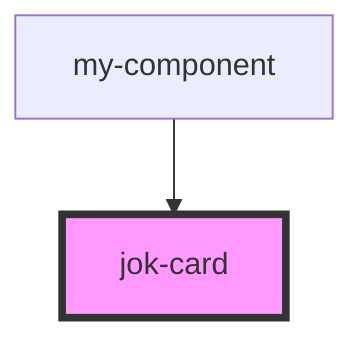

# jok-card

<!-- Auto Generated Below -->

## Properties

| Property | Attribute | Description | Type                               | Default     |
| -------- | --------- | ----------- | ---------------------------------- | ----------- |
| `color`  | `color`   |             | `string`                           | `undefined` |
| `state`  | --        |             | `{ name: string; email: string; }` | `undefined` |

## Methods

### `method() => Promise<number>`

#### Returns

Type: `Promise<number>`

## Dependencies

### Used by

 - [my-component](../my-component)

### Graph

----------------------------------------------

*Built with [StencilJS](https://stenciljs.com/)*
